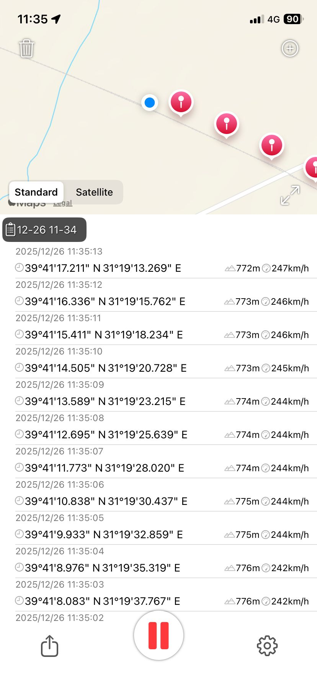

# High-Speed Train (HST) GPS Log Dataset (iPhone EXIF GPS Recorder) — Corporate Developer Documentation

## 1. Purpose and Scope

This document defines the **single source of truth** for processing the GPS log dataset collected during a field test on the **Yüksek Hızlı Tren (YHT)** — **High-Speed Train (HST)** — program, specifically on **YHT train set 65010**, on **2025-12-26**, for the **Polatlı–Ankara** service.

The goals of this document are to:
- Specify the **schema** and **field semantics** of the `.plist` GPS logs exported from an iPhone,
- Define **mandatory**, deterministic rules for parsing, normalization, validation, and exports,
- Ensure all developer teams produce **identical results** from the same raw input,
- Standardize preparation steps for **time-aligned comparison** with the AMiT GPS unit.

This document must be treated as a **non-negotiable reference implementation guide**.

---

## 2. Data Source and Collection Details

- Program / Context: **Yüksek Hızlı Tren (YHT) / High-Speed Train (HST)** field test (synchronized verification against AMiT GPS unit)
- Train set: **65010**
- Service: **Polatlı–Ankara**
- Date: **2025-12-26**
- Collection device: **Apple iPhone 11**
- OS version: **iOS 26.2**
- Application: **EXIF GPS Recorder**
  - App Store: https://apps.apple.com/mt/app/exif-gps-recorder/id6670551893
- Export format: Apple **Property List** (`.plist`, XML)
- **File Hash (SHA256):** `48525067A658D4785D9290A5E3BAFFE86326EA4EA2EC16803498B84C9D03A84A`

Example application screenshot: 

---

## 3. File Format and Overall Structure

The dataset is exported as an Apple `.plist` XML file.

Root structure:

- `<plist version="1.0">`
  - `<dict>` (root dictionary)
    - `createDate` (string)
    - `modifyDate` (string)
    - `gpsRecords` (array of dict)

This is **not** JSON. The implementation must perform XML parsing and strict type mapping.

---

## 4. Schema Definition

### 4.1 Root Keys

| Key | Type | Example | Description |
|-----|------|---------|-------------|
| `createDate` | `string` | `2025/12/26 11:18:32` | Log creation time (application metadata) |
| `modifyDate` | `string` | `2025/12/26 11:20:26` | Log last modification time (application metadata) |
| `gpsRecords` | `array<dict>` | - | Time-series GPS samples |

### 4.2 `gpsRecords[]` Keys

Each record contains:

| Key | Type | Example | Description / Unit |
|-----|------|---------|--------------------|
| `gpsDate` | `string` | `2025/12/26 11:20:26` | Human-readable timestamp; contains no timezone information |
| `timeStamp` | `integer` | `1766737226` | Unix epoch timestamp in **seconds**; primary time key for processing |
| `gpsLatitude` | `real` | `39.6481579779...` | Latitude, WGS84 degrees |
| `gpsLongitude` | `real` | `31.9488236502...` | Longitude, WGS84 degrees |
| `gpsAltitude` | `real` | `714.66044295...` | Altitude, meters (m) |
| `gpsSpeed` | `real` | `70.11261014...` | Speed (see Footnote-1) |

---

## 5. Time Handling and Ordering (MANDATORY)

### 5.1 Primary Time Source

**Primary time field**: `timeStamp`  
All ordering, joining, and synchronization operations must use `timeStamp` as the single authoritative time key.

Rationale:
- `gpsDate` contains no timezone information and is therefore not reliable for correlation.
- `createDate` / `modifyDate` are metadata and must not be used for record-level processing.

### 5.2 Ordering Rule

`gpsRecords` may not be reliably ordered in the file. Before any processing:

- Records must be sorted by `timeStamp` ascending (**ASC**).

### 5.3 Duplicate Timestamps (Deduplication)

If multiple records share the same `timeStamp`, a deterministic selection is required:

**Selection precedence:**
1. Record with valid `gpsLatitude` and `gpsLongitude`,
2. Record with valid `gpsSpeed` (`gpsSpeed != -1`),
3. Record with non-null `gpsAltitude`,
4. If still tied: the record that appears **later** in the file (stable “last wins”).

This rule is mandatory to guarantee reproducible output.

---

## 6. Speed Field (gpsSpeed) — Normalization Rules

### 6.1 Invalid Values

- `gpsSpeed = -1` indicates **no measurement / invalid**.
- This must be normalized to `null` (or `NaN`) in downstream processing.

### 6.2 Unit Standardization

All outputs must standardize speed to **km/h**.

Based on confirmed field information, `gpsSpeed` in the `.plist` is stored in **m/s** (see Footnote-1). Therefore, the standard conversion is:

> **speed_kmh = gpsSpeed * 3.6** (when `gpsSpeed` is valid)

---

## 7. Data Quality and Validation (MANDATORY)

No dataset is considered “ready for use” unless the following controls are implemented.

### 7.1 Coordinate Validation

For every record:
- `-90 <= gpsLatitude <= 90`
- `-180 <= gpsLongitude <= 180`

If violated, the record must be flagged as `invalid_coordinate`.

### 7.2 Time Validation

- `timeStamp` must be present.
- Large gaps in `timeStamp` progression (e.g., > 5 seconds) may be flagged as “missing samples”.
- **Interpolation is not required**; preserve raw truth first.

### 7.3 Physical Limit / Jump Detection (Recommended Corporate Control)

Between consecutive records:
- `deltaTime = ts[i] - ts[i-1]` (seconds)
- Compute distance (Haversine recommended)
- `computed_speed_kmh = (distance_m / deltaTime) * 3.6`

Recommended threshold (configurable):
- `computed_speed_kmh > 400` ⇒ flag `jump_detected`

Purpose:
- Identify GPS jitter, multipath errors, or sampling anomalies.

---

## 8. Recommended Canonical Output Model

Because multiple internal systems may consume this dataset, a single canonical model is recommended.

**TrackPoint (normalized)**

| Field | Type | Description |
|------|------|-------------|
| `ts_epoch_s` | `int64` | `timeStamp` (primary key) |
| `ts_utc` | `string` | ISO-8601 UTC timestamp |
| `lat` | `double` | WGS84 |
| `lon` | `double` | WGS84 |
| `alt_m` | `double?` | meters |
| `speed_kmh` | `double?` | km/h (normalized) |
| `source` | `string` | e.g., `iphone_exif_gps_recorder` |
| `flags` | `string[]` | `speed_invalid`, `invalid_coordinate`, `jump_detected`, etc. |

---

## 9. Output Artifacts and Deliverables

The following outputs are recommended:

1. **CSV (operational sharing)**
   - `output/track_points.csv`

2. **GeoJSON (mapping / GIS)**
   - `output/track.geojson`

3. **Summary JSON (reporting)**
   - `output/summary.json` (min/max/avg speed, total points, total duration, total distance, etc.)

---

## 10. Reference Processing Pipeline

1) Read file (`.plist` → object model)  
2) Extract `gpsRecords` array  
3) Enforce `timeStamp` presence  
4) Sort by `timeStamp ASC`  
5) Deduplicate using the deterministic rule  
6) Normalize:
   - `gpsSpeed == -1` ⇒ `null`
   - `speed_kmh = gpsSpeed * 3.6` (when valid)
7) Validate & flag:
   - coordinate validation
   - jump detection (recommended)
8) Export (CSV / GeoJSON / JSON)

---

## 11. Implementation Notes

- Treat `gpsDate` primarily as a UI/debug field. `timeStamp` is the only reliable time key.
- Preserve raw data. Produce filtered/normalized views separately.
- Thresholds (jump detection, gaps, etc.) must be configurable.

---

## 12. Time-Aligned Comparison with AMiT GPS Unit

For AMiT synchronization, the primary matching key is:
- `timeStamp` (epoch seconds) or the equivalent epoch field on the AMiT side.

Recommended approach:
- Perform an **outer join** on `ts_epoch_s` to keep missing samples visible.
- Support an optional ±N second alignment window (e.g., ±2s). Any offset applied must be explicitly stated in formal reports.

---

## 13. Acceptance Criteria (Definition of Done)

The processing module is considered complete only when:

1. The `.plist` file is parsed successfully.
2. `gpsRecords` are sorted by `timeStamp ASC`.
3. Duplicate `timeStamp` records are resolved deterministically.
4. `gpsSpeed = -1` values are normalized to `null`.
5. Speed is standardized to **km/h** (`speed_kmh = gpsSpeed * 3.6`).
6. Invalid coordinates are flagged.
7. Outputs (CSV + GeoJSON + summary JSON) are generated.
8. Raw vs. normalized separation is maintained for auditability.

---

## Footnotes

**Footnote-1 (Speed unit discrepancy):**  
The EXIF GPS Recorder application displays speed in **km/h** in the user interface (as shown in the screenshot). However, within the exported `.plist`, the `gpsSpeed` value is stored in **m/s**. Therefore, it must be converted to the project standard **km/h** using `speed_kmh = gpsSpeed * 3.6`.

---